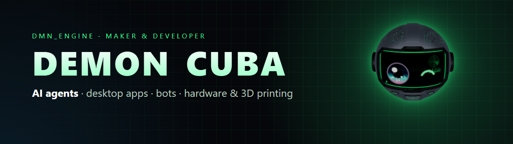

  

  
  

### 👋 Hola, soy DMN_ENGINE

Maker y developer 🇨🇺. Construyo **agentes de IA**, apps de escritorio, bots y hardware, desde el código hasta la pieza impresa en 3D.

- 🤖 Ahora mismo: **[APOLO](https://github.com/DMNENGINE/apolo)**, un robot 3D de escritorio que vigila y dirige a tus agentes de IA.
- 🧠 Me interesan los agentes autónomos, el uso del PC por IA, la voz y la robótica.
- 🛠️ También diseño en Blender, imprimo en 3D y monto proyectos con Raspberry Pi.
- 💬 Hablo español e inglés.

### 🚀 Proyectos destacados

| Proyecto | Qué es |
|---|---|
| **[APOLO](https://github.com/DMNENGINE/apolo)** | Compañero de IA para el escritorio: permisos desde isla, Discord y Stream Deck, núcleo multi-modelo con memoria, tareas y subagentes. |
| **[Auto Scroll Pro](https://github.com/DMNENGINE/Auto-scroll-pro)** | Extensión de auto scroll para TikTok, YouTube Shorts y Reels con modo PiP inteligente. |

### 🧰 Tecnologías

  
  
  
  
  
  
  
  
  
  
  
  

### 📊 Actividad

  
  

